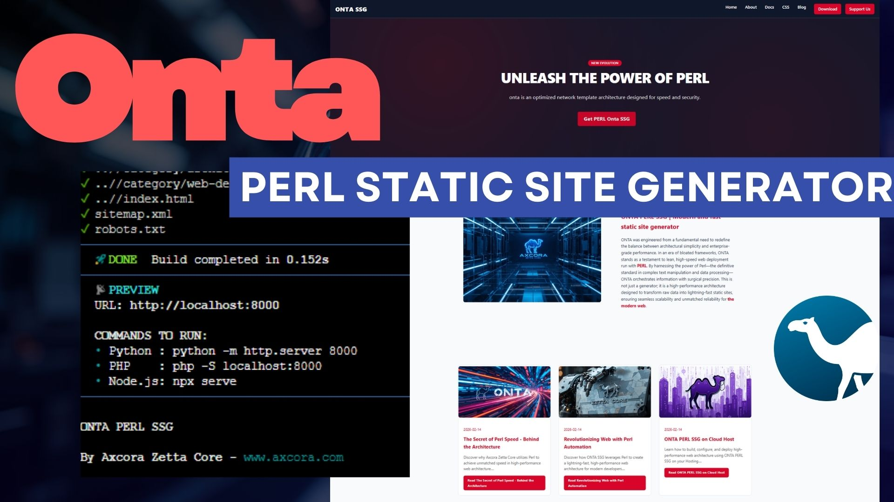

# ▲ ONTA PERL SSG

### PERL Static Site Generator by Axcora Zetta Core

**ONTA PERL SSG** is a high-performance static site architecture driven by Perl. 

Engineered for web architects who prioritize speed, efficiency, and security. 

Built on the **Axcora Zetta Core Concept**, it transforms raw content into lightning-fast, production-ready static websites with zero complex dependencies.

RUN DEMO : [https://axcora.my.id/onta/](https://axcora.my.id/onta/)

DOCUMENTATION OFFICIAL SITE: [https://onta.axcora.com/](https://onta.axcora.com/)

---



---

## 🚀 Why ONTA?
* **Pure Perl Power:** Leveraging Perl's legendary text processing for near-instant builds.
* **Axcora Zetta Core Concept:** Optimized for JAMSTACK and modern automated workflows.
* **Zero Dependencies:** Runs on core Perl modules—perfect for cPanel, VPS, or local dev.
* **Auto-SEO & Meta:** Built-in dynamic generation of `sitemap.xml`, `robots.txt`, and advanced architecture metadata.
* **Flexible Collections:** Effortlessly manage blogs, portfolios, or services by simply organizing folders.

## 📁 Project Structure

```
.
├── assets/             # CSS, JS, and Media assets
├── core/               # Axcora Zetta Core (Engine logic & Core modules)
├── content/            # Source content in .txt (Blog, Page, Services)
├── layout/             # HTML Templates & Partials
├── config.json         # Global configuration & Site info
├── onta.pl             # The Engine - Run this to generate your site
└── README.md           # Readme File
```

## 🛠 Getting Started

1. Requirements

You only need Perl installed on your system or server.
```
perl -v
```

Helper: installation slurp on your terminal
```
cpan File::Slurp
```

## 2. Build the Site

Open terminal on cpanel or your host - Navigate to your project directory 
```
cd public_html/myproject/onta
```

and run the engine:
```
perl onta.pl
```

The engine will scan your content/ directory, process the layout/, 
and generate a fully optimized static site in the parent or target public directory.

## 3. Creating Content

To add a new post or page, simply create a .txt file in content/. 

Advance : To add a new collection (e.g., Services), just create a new folder:
```
mkdir content/services
```
Onta will automatically detect the new collection and render it based on your defined layouts.

## 🏷 Enterprise Metadata

ONTA injects deep architectural signatures into every page for superior branding and SEO:

Brand: ONTA SSG / Axcora Zetta Core

Architecture: Perl Driven Static Architecture

Engine: Onta PERL SSG V.1

Template Engine: Perl Custom Injector

## 🌐 Deployment

Perfect for cPanel Terminal, Shared Hosting, or VPS. 

Since it generates pure static HTML, you can host the output anywhere—from GitHub Pages to high-end enterprise servers.

---

Crafted by Axcora Zetta Core
Architecting Web Efficiency and Speed.
Official Web: www.axcora.com | Lab: www.axcora.my.id

Reviving the glory of Perl for the modern web.
